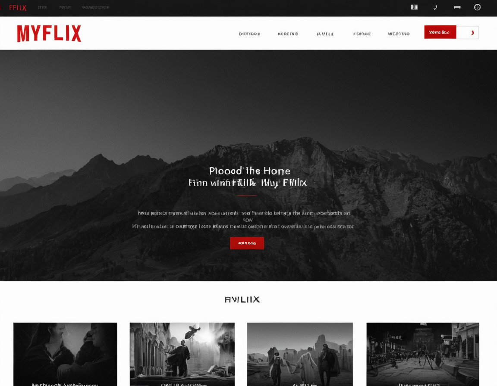

# MyFlix

MyFlix is a personal video streaming application, developed as a full-stack project for educational   
and portfolio purposes. It allows users to stream movies from a home server, accessible from any   
location with an internet connection.

## Features

- **User Authentication:** Secure login system for users.
- **Movie Streaming:** Stream movies directly from the application or through a web browser.
- **Movie Information:** View detailed information about movies.
- **Admin Control:** Only the main ADMIN user has the authority to add additional members.
- **Cross-Platform Compatibility:** Accessible from various devices.
- **Donation Payment System:** A way for fans to donate to my various projects.

## Technologies Used

- **Frontend:** React
- **Backend:** Node.js, Express.js
- **Database:** MongoDB with Mongoose ODM
- **Authentication:** JWT (JSON Web Tokens)
- **API Handling:** GraphQL for data retrieval and manipulation
- **Deployment:** Render

## Bonus I will try to implement
Although this is not a requirement for your project, see if you can also implement functionality to meet the minimum requirements of a PWA:

- Uses a web manifest

- Uses a service worker for offline functionality

- Is installable

## Getting Started

### Prerequisites

- Node.js
- MongoDB
- Git

### Installation

1. Clone the repository: git@github.com:S10skeleton/MyFlix-Shanes-P3.git

2. Install NPM packages:

3. Setup environment variables in `.env` file.

4. Start the server: 'npm start'

## Usage

After starting the server, navigate to `http://localhost:3000` on your web browser to access the MyFlix application.

## Contributing

As this is a personal project for school, contributions are not currently being accepted.

## License

This project is licensed under the MIT License.

## Contact

Shane Beaman S10skeleton@gmail.com

Project Link: https://github.com/s10skeleton/myflix-shanes-p3

## Acknowledgments

- [React](https://reactjs.org/)
- [Node.js](https://nodejs.org/)
- [Express.js](https://expressjs.com/)
- [MongoDB](https://www.mongodb.com/)
- [Mongoose](https://mongoosejs.com/)
- [JWT](https://jwt.io/)
- [GraphQL](https://graphql.org/)

---

© 2024 Shane Beaman. All Rights Reserved.
